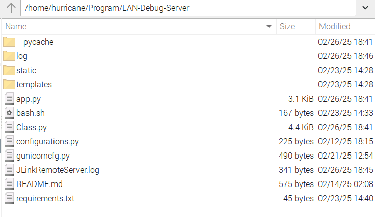
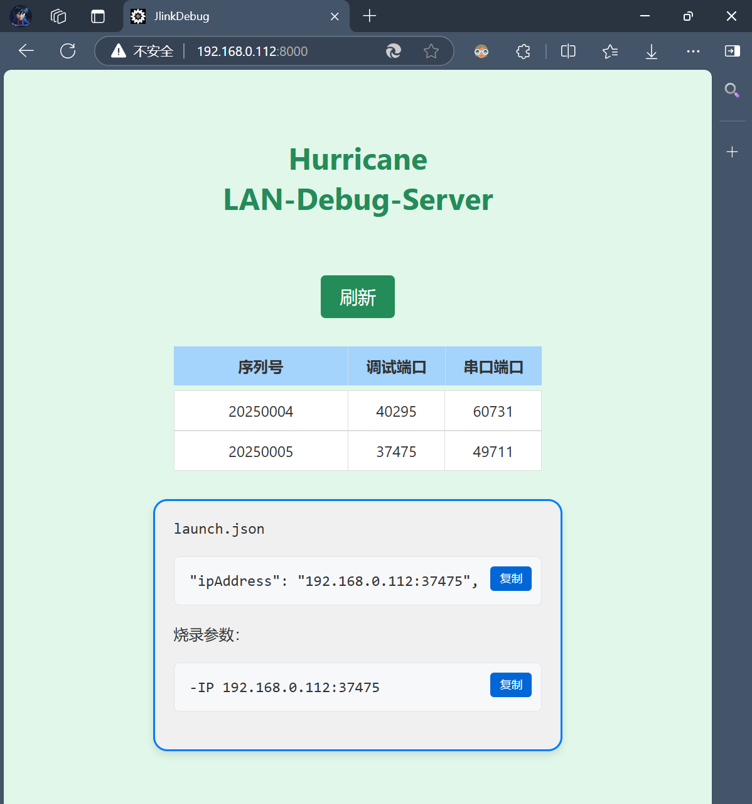
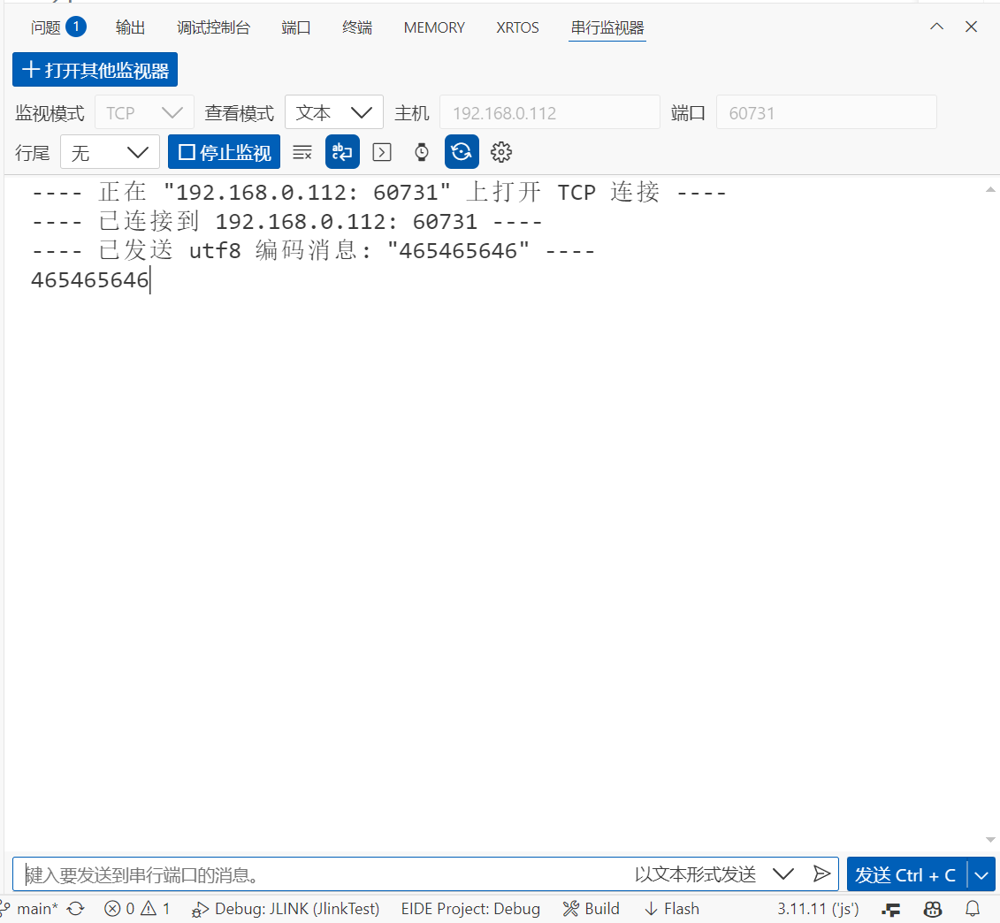

### 概述：

该项目是运行在Linux环境下的一个flask应用，作用是为JLink提供远程调试服务，同时支持使用jlink上自带的串口进行无线通信。将项目部署在linux设备上在同一局域网下通过浏览器访问`http:服务器Ip:8000`即可浏览服务器所连所有Jlink信息，在修改在本地调试配置文件之后即可进行无线调试。

### 部署：

1. 在服务器上创建项目文件夹，并将项目文件复制到项目文件夹下。
2. 创建python虚拟环境，并安装依赖（在`requirement.txt`文件当中）。
3. 为服务器安装JLink的驱动程序。
4. 将项目文件中`bash.sh`,`configurations.py`文件当中的路径更改为实际路径
5. 将bash.sh脚本添加成为服务开机自启。

项目目录：

浏览器页面：

串口通讯：

使用VScode的串行监视器的TCP模式，输入IP和想要监视的串口端口号，即可进行串口通讯。

