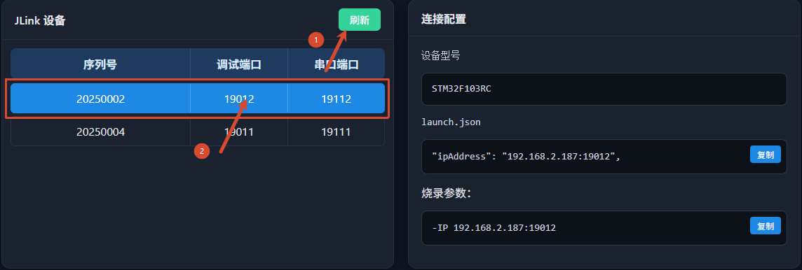
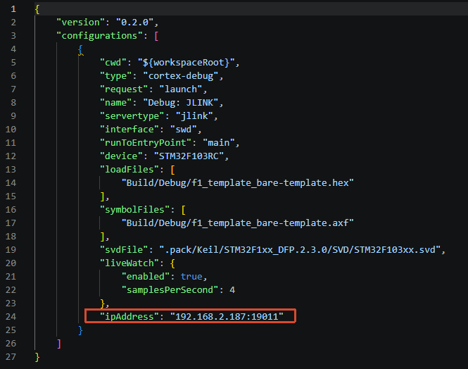
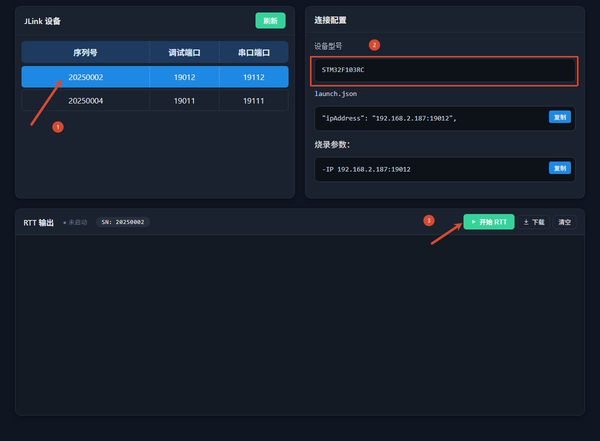
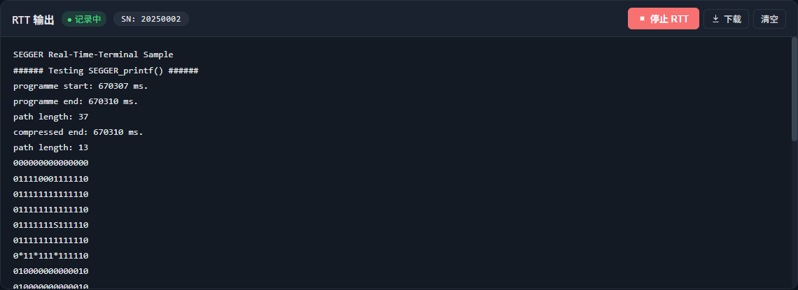

### 简介：

该项目是运行在`Linux`环境下的一个`flas`k应用，作用是为`JLink`提供远程调试服务，同时支持使用`JLink`上自带的串口进行无线通信，RTT 数据的显示（通道0）。将项目部署在`Linux`设备上在同一局域网下通过浏览器访问`http:服务器Ip:8000`即可浏览服务器所连所有`JLink`信息，在修改在本地调试配置文件之后即可进行无线调试。已在`树莓派4B 4G + Ubuntu Server22.04`环境下运行通过。

### 部署：

#### 自动

1. 将仓库克隆或者复制至设备的用户目录下。
2. 执行`pack`文件夹下的`depley.sh`脚本，一键完成部署。

#### 手动

1. 在服务器上创建项目文件夹，并将项目文件复制到项目文件夹下。
2. 创建python虚拟环境，并安装依赖（在`requirement.txt`文件当中）。
3. 为服务器安装JLink的驱动程序。
4. 将项目文件中`bash.sh`,`configurations.py`文件当中的路径更改为实际路径
5. 将bash.sh脚本添加成为服务开机自启（可参考pack文件夹下的文件）。

### 使用说明

#### 概述

点击`Jlink`设备卡片上的刷新按钮显示设备上连接的所有`Jlink`，在下方列表点击要查看的`JLink`右侧连接配置卡片会显示对应`JLink`的信息。

- 设备型号：由用户手动输入`JLink`连接的芯片型号，默认记忆`JLink`上次连接的型号。
- lauch.json：用于设置`crotex-debug`调试配置项，直接复制使用。
- 烧录参数：用于EDIE设置JLInk无线烧录参数，直接复制使用。

#### 无线烧录

即可进行无线烧录。

#### 无线调试

#### 无线串口

查看对应`JLink`的串口端口。

使用`VSCode`的串行监视器插件`TCP`模式连接无线串口。

#### RTT记录

如果设备有写RTT数据输出，可在网页上查看RTT通道0的数据。
选则在要查看的`JLink`，确保与`JLink`连接的设备型号输入正确，点击开始`RTT`即可开始`RTT`数据记录。

如图：

