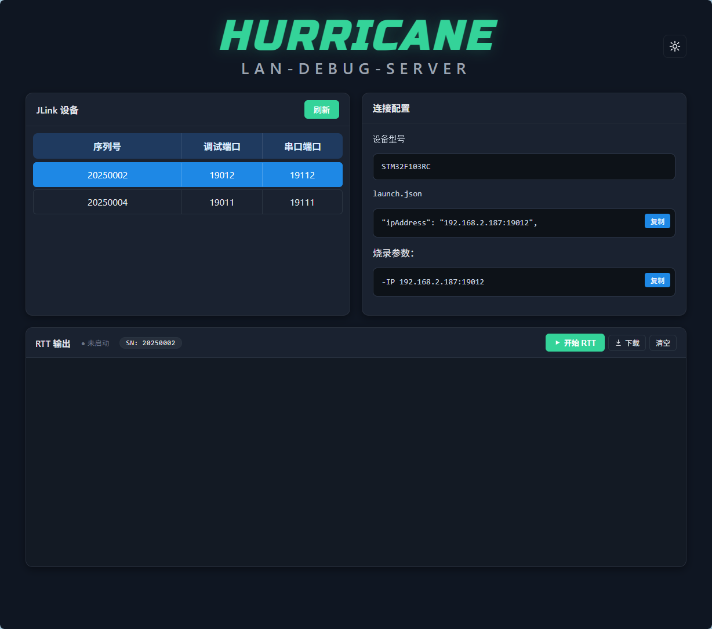
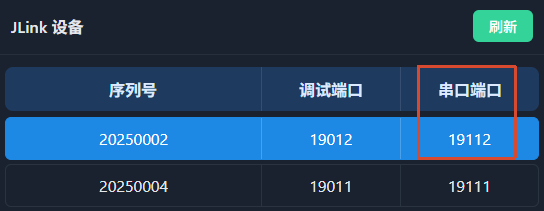
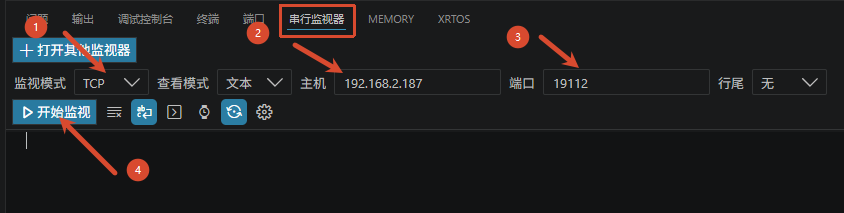
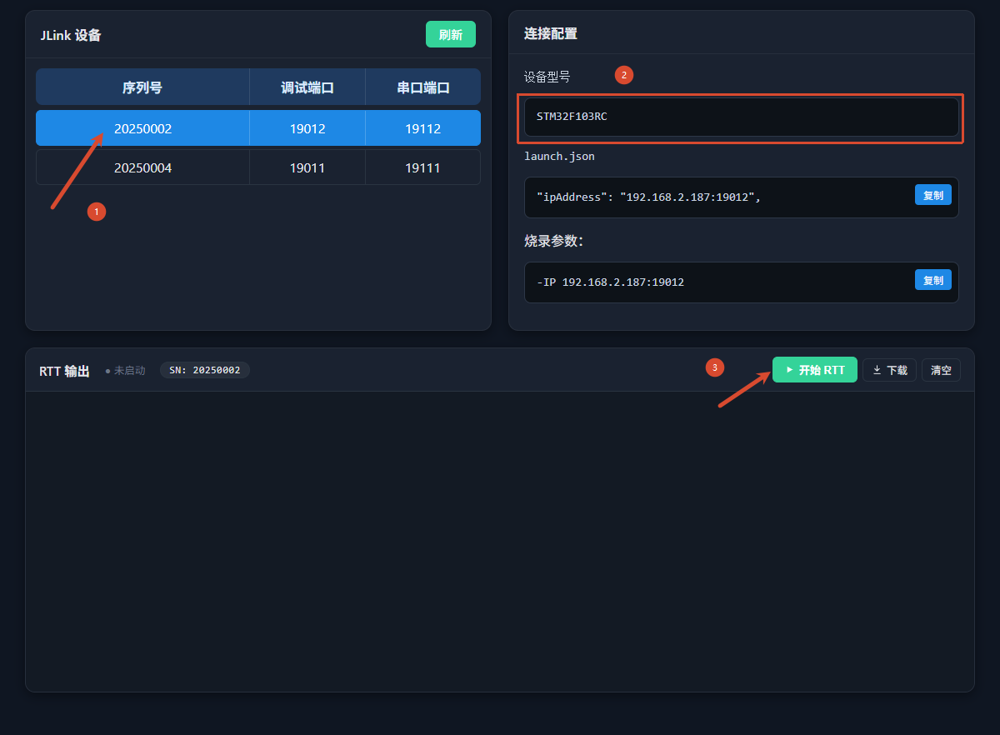
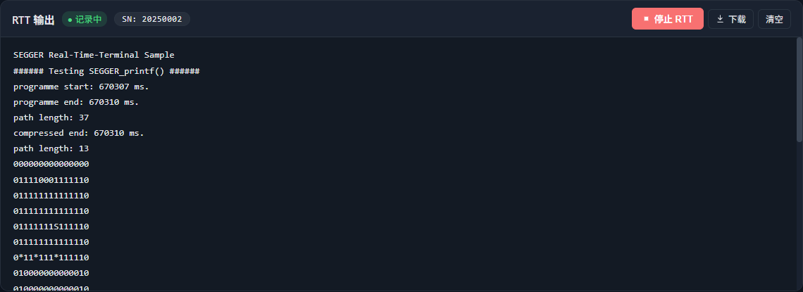

### 简介：

该项目是运行在`Linux`环境下的一个`flas`k应用，作用是为`JLink`提供远程调试服务，同时支持使用`JLink`上自带的串口进行无线通信，RTT 数据的显示（通道0）。将项目部署在`Linux`设备上在同一局域网下通过浏览器访问`http:服务器Ip:8000`即可浏览服务器所连所有`JLink`信息，在修改在本地调试配置文件之后即可进行无线调试。已在`树莓派4B 4G + Ubuntu Server22.04`环境下运行通过。

### 部署：

#### 自动

1. 将仓库克隆或者复制至设备的用户目录下。
2. 在项目根目录以普通用户执行 `bash pack/deploy.sh`，一键完成部署（内部按需 sudo）。
3. 确认部署后，脚本会询问局域网访问名称，例如输入 `robot`，部署完成后访问 `http://robot.local:8000`。回车沿用已有 Avahi 名称，首次默认使用系统短主机名。

#### Avahi 与 Windows 代理

已有部署可在 Linux 服务端单独执行 `bash pack/configure-avahi.sh`，或用 `bash pack/configure-avahi.sh robot` 指定名称。脚本安装并启用 `avahi-daemon`，仅修改 `/etc/avahi/avahi-daemon.conf` 的 `[server] host-name`，修改前自动备份。系统 hostname、hosts、DHCP、IPv6 和其他 Avahi 设置保持原样；已有特殊域名或机器 ID 命名配置时会提示检查。

客户端和服务端需在同一局域网，网络须允许设备互通和 UDP 5353 mDNS。若名称冲突，Avahi 可能自动改名，可用 `sudo journalctl -u avahi-daemon -b` 查看实际发布名称。

Windows 使用 Clash Verge 的**系统代理默认模式**时，在系统代理设置的绕过列表中**保留原有项，追加 `*.local`**。若不能编辑，检查当前版本是否需要关闭“始终使用默认绕过”，保存后确认生效。`<local>` 只匹配不含点的短主机名，不能覆盖 `robot.local`；仅增加 `DOMAIN-SUFFIX,local,DIRECT` 也不能替代系统代理绕过，因为请求仍可能交给代理解析。PAC / TUN 模式需分别检查其绕过、DNS 与路由设置。

Windows 可用 `curl.exe --noproxy "*" --connect-timeout 5 -I http://robot.local:8000/` 检查直连 HTTP（将 robot 换为自己的名称）。

参考：[Clash Verge 代理绕过说明](https://www.clashverge.dev/guide/bypass.html)、[Chromium 代理绕过规则](https://chromium.googlesource.com/chromium/src/+/HEAD/net/docs/proxy.md)。

#### 手动

1. 在服务器上创建项目文件夹，并将项目文件复制到项目文件夹下。
2. 创建python虚拟环境，并安装依赖（在`requirement.txt`文件当中）。
3. 为服务器安装JLink的驱动程序。
4. 将项目文件中`bash.sh`,`configurations.py`文件当中的路径更改为实际路径
5. 将bash.sh脚本添加成为服务开机自启（可参考pack文件夹下的文件）。



### 使用说明

#### 概述

点击`Jlink`设备卡片上的刷新按钮显示设备上连接的所有`Jlink`，在下方列表点击要查看的`JLink`右侧连接配置卡片会显示对应`JLink`的信息。

- 设备型号：由用户手动输入`JLink`连接的芯片型号，默认记忆`JLink`上次连接的型号。
- 客户端配置：填写芯片型号后，可复制或下载 `remote-jlink.json`，保存到客户端工程的 `Debug_LAN/` 目录。这是客户端工具的配置，不是服务端 Avahi 配置。
- 服务器名称：优先读取 Avahi 当前实际发布的名称；不可读取时，参考当前网页的 `.local` 名称、Avahi 配置文件或服务器 IPv4，并显示来源。配置文件中的名称未必等于当前发布名称（例如名称冲突），请按提示核对；也可手动编辑。
- 高级设置：配置客户端接口和速度，默认 `SWD` / `8000 kHz`；网页 RTT 仍使用服务端自身的接口和速度设置。已有自定义 `JLinkExe` 路径时，下载后保留实际路径。
- 网页不会生成 `launch.json`。其芯片、ELF 和 SVD 路径需在客户端工程中手动核对。
- Custom CLI 远程烧录：设备列表下方分别提供 Windows / Linux 命令及复制按钮，粘贴到 EIDE 的 Custom CLI 烧录配置。客户端需先准备 `Debug_LAN` 工具包和配置；该工具未配置全片擦除。
- 布局：上方选择设备和生成客户端配置，下方 RTT 适应窗口剩余高度；点击“放大”专注查看 RTT，点击“还原”或按 Esc 返回。

下方旧版使用截图仅用于参考；当前连接配置以 `Debug_LAN` 客户端工具包为准。

#### 无线烧录

先按客户端工具包 `Debug_LAN/README.md` 将工具复制到实际工程。需要 EIDE 单独远程烧录时，选择 `Custom CLI`，填写：

```text
python "${ProjectRoot}/Debug_LAN/jlink_flash.py" --program "${programFile}"
```

Linux 将 `python` 改为 `python3`。脚本读取工程内的 `Debug_LAN/remote-jlink.json`；网页下载的配置需手动保存到该位置。

#### 无线调试

将工具包 `Debug_LAN/vscode/launch.json` 和 `tasks.json` 合并到工程 `.vscode/`，手动核对 `launch.json` 的芯片、ELF 和 SVD 路径。编译后选择 `Debug: JLINK LAN` 并按 F5，前置任务自动启动本机 GDB Server，调试连接使用 `127.0.0.1:2331`，远程探针地址由客户端 JSON 指定。

网页端口 `8000`、远程探针端口和本机 GDB 端口作用不同，不能互相替代。调试前停止占用同一探针的网页 RTT 或其他会话；F5 会下载 ELF，无需先单独烧录。

#### 无线串口

查看对应`JLink`的串口端口。



使用`VSCode`的串行监视器插件`TCP`模式连接无线串口。



#### RTT记录

如果设备有写RTT数据输出，可在网页上查看RTT通道0的数据。
选则在要查看的`JLink`，确保与`JLink`连接的设备型号输入正确，点击开始`RTT`即可开始`RTT`数据记录。



如图：

